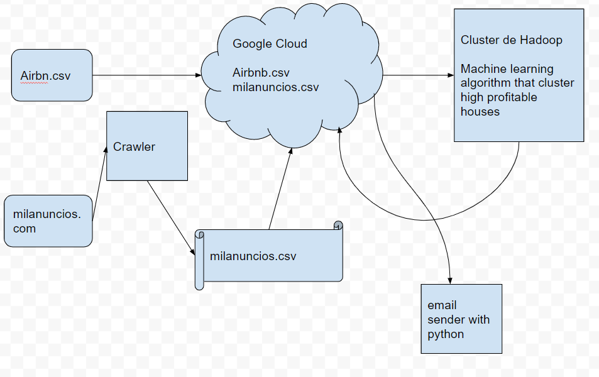

# Practica-Big-Data-Architecture

## Estrategia
El objetivo del proyecto es diseñar una aplicacion que recomiende los 5 Airbnbs con mayor potencial rentabilidad, teniendo en cuenta factores estructurados en cuanto a las caracteristicas de la casa como:
su cercania a lugares de interés
transporte público
barrio
metros cuadrados
numero de habitaciones y de baños…

y de factores provenientes de datos no estructurados como:
Fotografias de la casa
opiniones de antiguos usuarios
numero de veces que aparecen en los buscadores online…

El sistema se alimentará a diario con datos y sera capaz de propocionar recomendaciones bajo demanda. 

Así mismo, los modelos predictivos en los que se basan se reentrenarán semanalmante con los nuevos datos, para poder ser capaces de proporcionar recomendaciones precisas.

## Arquitectura:
### Servicio Cloud:
Para el almacenamiento de datos y desarrollo de soluciones analíticas. Dado que el objetivo es tener un sistema que sea facilmente escalable y de bajo coste de mantenimiento, esta es la solucion mas factible. En concreto, usaremos la solucion de Google Cloud Storage, que además tiene multitud de servicios de analisis y streaming de datos. Aqui cargaremos el dataset de airbnb.csv en el que basaremos nuestro sistema.
### Crawler:
Para extraer mas datos relevantes, usaremos un crawler en las principales paginas de anuncios inmobiliarios, en la propia pagina de airbnb y en tripadvisor. Dichos datos también se cargarán en el cloud de Google.
### Cluster Hadoop:
Se utilizará un cluster de Hadoop para para hacer apropiado tratamiento de los datos, la construccion y el despliegue del modelo predictivo. Una vez obtenidas unas predicciones, estas se cargaran de vuelta en el cloud de Google.
### E-mail:
Por último, se enviará vía e-mail los resultados de los modelos predictivos previamente cargados en el cloud de Google. Se desarrollará un programa de Python que realizará dicha tarea.

## Operacion
Cargar el csv en el cloud
Crawlear todos los dias a las 8 AM
Se tratarán los datos en el cluster de Hadoop una vez obtenidos los resultados del Crawling
Se enviarán los e-mails cada lunes a las 8 AM

## Desarrollo
Ver el diagrama a continuación:

## Definicion
### 1.- Servicio Cloud
#### 1.1 Levantar el Cluster
Entraremos en Google Cloud Storage, apartado de dataproc y clusteres y crearemos un clúster.

#### 1.2 Cortafuegos
Levantaremos un cortafuegos con intervalos de IP de Origen 0.0.0.0/0.

#### 1.3 Subiremos los archivos de airbnb.csv
Para poder cargar datos en hdfs, accederemos al segmento del cluster y subiremos los archivos.

Además asignaremos una tarea tipo Hadoop, con argumentos de Worcount para que nos procesen las palabras de dicho archivo.

##### 1.4 Utilizaremos HIVE en GCloud
Acciendo a la regla de cortafuegos de hadoopie, la modificaremos para poder acceder a ella através de python. Editando los protocolos y puertos específicos, añadiremos el tcp:10000 que es el puerto por defecto de Hadoop. Al guardar podremos acceder remotamente con python.

Entraremos con el gcloud shell y utilizaremos beeline para crear las tablas correspondientes

### 2.- Crawling
Pondremos a trabajar un scrapper en las paginas de milanuncios.com y de airbnb.com para extraer información relevante de las casas que tenemos en el dataset de airbnb.csv. 

Con esto crearemos un fichero que cargaremos tambien en el storage de goodle y pasaremos a hdfs para contrastar con los datos del anteriormente mencionado dataset.

### 3.- Hadoop
Una vez tenemos toda la información disponible en Hadoop se realizara un analisis de datos automatico, que teniendo en cuenta diversas caracteristicas de las casas, sea capaz de encontrar aquellas que tengan un valor de mercado tales que permitan obtener rentabilidades tras su compra en un tiempo menor a 2 años.

Una vez encontradas estas viviendas, se cogerán las 5 con el precio mas bajo y se enviarán dichos resultados de vuelta al Google Cloud Storage.

### 4.- E-mail
Por último se desarollará un cofigo en python que envíe recurrentemente por correo electrónico dichos resultados.
